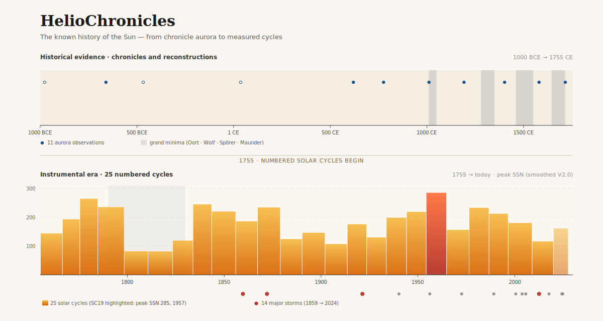
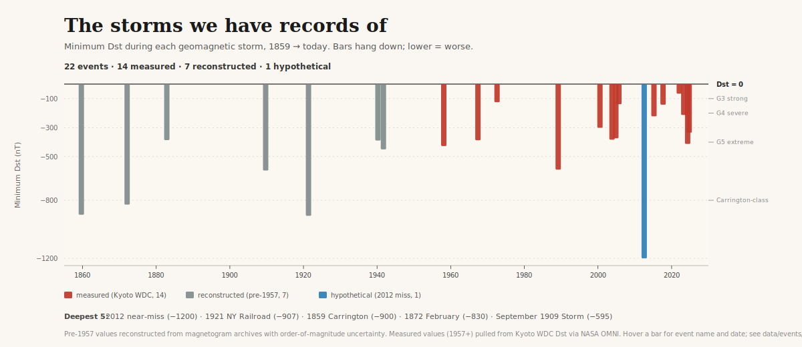

# HelioChronicles

**The known history of the Sun — from cuneiform aurora records (660 BCE) to hourly solar wind (today), in one repo.**



Sunspot numbers from Galileo forward. Geomagnetic indices from 1868. Hourly solar wind from 1963. Aurora observations from Assyrian tablets forward. Every solar cycle since 1755, every major storm since 1859, every driving active region. Plain-text CSVs and JSON. No API, no hosted service, no runtime dependency. Clone the repo, open the files.

> Status: **v0.9.0 — pre-1.0 polish.** Schema is frozen, curation is complete across cycles, grand minima, historical storms, aurora observations, and active regions. The numerical-record CSVs (daily, hourly, monthly, yearly) populate the moment `npm run build` runs with network access. v1.0.0 is tagged once the storm-catalog integrity check returns 🟢 against measured OMNI data.

---

## Start here

- 📍 **[`docs/POSTCARD.md`](./docs/POSTCARD.md)** — ten plain-text facts about the known history of the Sun, extracted from the catalogs. One page, every number sourced.
- 📊 **[`docs/ANALYSIS.md`](./docs/ANALYSIS.md)** — machine-generated report: cycle statistics, grand-minima context, aurora catalog, notable storms, source-region back-references, and the Dst integrity check.
- 📋 **[`docs/DATA_DICTIONARY.md`](./docs/DATA_DICTIONARY.md)** — column-by-column spec for every table.
- 💻 **[`examples/`](./examples/)** — runnable Python, R, and DuckDB queries over the data.

## What's in the repo

| Path                                | Content                                                                        |
|-------------------------------------|--------------------------------------------------------------------------------|
| `data/hourly/hourly_YYYY-YYYY.csv`  | NASA OMNI solar-wind, IMF, Dst, ap, AE at hourly cadence (1963+)               |
| `data/daily/daily_YYYY-YYYY.csv`    | SILSO SSN + GFZ Kp/ap + DRAO F10.7 + ISGI aa + cycle metadata, daily (1818+)   |
| `data/monthly/monthly_1749-today.csv` | SILSO monthly mean SSN (1749+)                                               |
| `data/yearly/yearly_1610-today.csv` | SILSO yearly SSN + Hoyt-Schatten / Svalgaard GSN (1610+)                       |
| `data/cycles/solar_cycles.json`     | Solar cycles 1–25, curated from SIDC-SILSO                                     |
| `data/cycles/grand_minima.json`     | Grand minima (Oort, Wolf, Spörer, Maunder, Dalton, Gleissberg)                 |
| `data/events/historical_storms.json`| 14 notable storms from Carrington 1859 to Gannon 2024, peer-reviewed           |
| `data/events/aurora_observations.json` | Pre-instrumental aurora records, 660 BCE → 1847 CE                          |
| `data/regions/notable_regions.json` | Active regions that drove catalog events (AR 5395, 10486, 12192, 13664, …)     |
| `docs/ANALYSIS.md`                  | Generated cross-referenced analysis report                                     |
| `docs/DATA_DICTIONARY.md`           | Schema spec for every table                                                    |
| `docs/POSTCARD.md`                  | Ten headline facts, one page                                                   |
| `SOURCES.md`                        | Upstream providers, URLs, licenses, citations                                  |

## Quickstart

Everything in `data/` is plain CSV or JSON. Read it the way you'd read any file.

**Python:**
```python
import json
with open("data/cycles/solar_cycles.json") as f:
    cycles = json.load(f)["cycles"]
# Works today. See examples/python/ for a longer pandas walkthrough.
```

**DuckDB (SQL over the local files):**
```sql
SELECT UNNEST(cycles, recursive := true)
FROM read_json('data/cycles/solar_cycles.json');
```

**Shell:**
```
head -3 data/events/historical_storms.json
```

More in [`examples/`](./examples/).

## Rebuilding the data

```
npm run build      # fetch from SILSO, GFZ, ISGI, OMNI; regenerate every CSV
npm run validate   # sanity check headers, dates, manifest checksums
npm run analyze    # regenerate docs/ANALYSIS.md (including the integrity check)
```

Requires Node.js ≥ 20. No runtime dependencies — standard library only.

The build is a **manual action**. No cron, no auto-commit, no weekly bot. Run it when you want a refresh; commit the result when you've checked it.

## Why this exists

Solar and space-weather data live on a dozen institutional portals, each with its own format and update cadence. Every researcher, educator, and tool-builder ends up writing the same fragile scrapers. HelioChronicles is one curated, schema-documented copy — designed to be readable offline, in this exact form, in twenty years.

The raw observations come from the institutions credited in [`SOURCES.md`](./SOURCES.md): SILSO (Royal Observatory of Belgium), GFZ Potsdam, NASA SPDF, DRAO Penticton (via GFZ), ISGI / BGS, Kyoto WDC (via OMNI), and SWPC. Once values are in this repo, they're here. No ongoing API dependency.

## Citing

`CITATION.cff` describes how to cite the compilation. Always also credit the upstream providers — they do the science. See [`SOURCES.md`](./SOURCES.md) for per-source references; `data/events/`, `data/cycles/`, and `data/regions/` carry per-entry citations embedded in the JSON.

## Licensing

- **Data** (`data/**`): [CC BY 4.0](./LICENSE-DATA).
- **Code** (`scripts/`, everything else): [MIT](./LICENSE).
- Individual upstream datasets may carry stricter terms (SILSO is CC BY-NC 4.0); per-source terms in [`SOURCES.md`](./SOURCES.md).

## Contributing

See [`CONTRIBUTING.md`](./CONTRIBUTING.md). Short version: every value traceable to a URL at an institutional provider or a peer-reviewed citation, every file reproducible from `npm run build` or hand-curated with sources, the schema in `docs/DATA_DICTIONARY.md` is the contract.

---



14 storms. 165 years. Three provenance tiers: **measured** values from Kyoto WDC (1957+), **reconstructed** values from pre-Dst magnetogram archives, and one **estimated** outlier — the 2012 near-miss CME whose −1200 nT is a model projection of what would have happened if Earth had been in the path.

The six tallest bars span 165 years of instrumental record. Four are pre-satellite reconstructions (Carrington 1859, 1872, the NY Railroad Storm 1921) and one is a hypothetical (July 2012). Only one is a measured 20th-century extreme: Quebec 1989 at Dst = −589 nT. The May 2024 **Gannon Storm** at Dst = −412 nT broke a 21-year drought of G5-class storms, dating back to Halloween 2003.

Every bar is linked to its driving active region in `data/regions/notable_regions.json`, its peer-reviewed sources in `data/events/historical_storms.json`, and (once `npm run build hourly` populates OMNI) its measured hourly Dst trace in `data/hourly/*.csv` — where the integrity check verifies the catalog value matches the measured minimum within ±5 nT.
